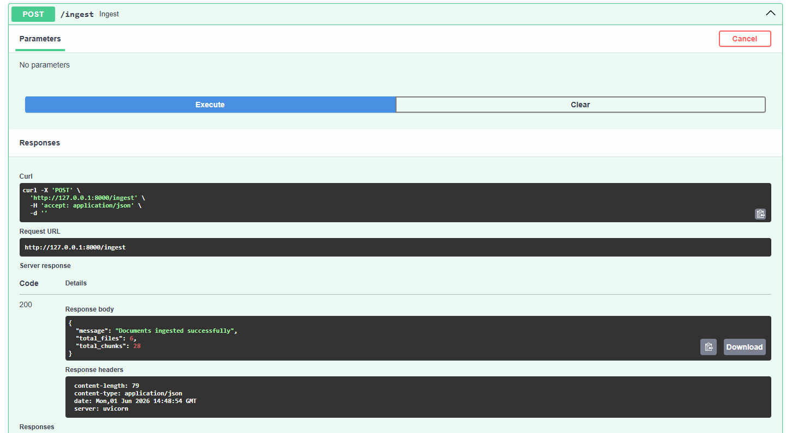
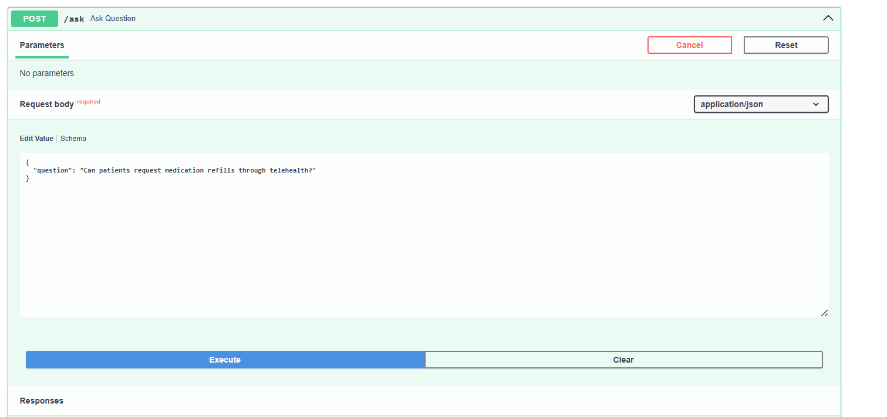
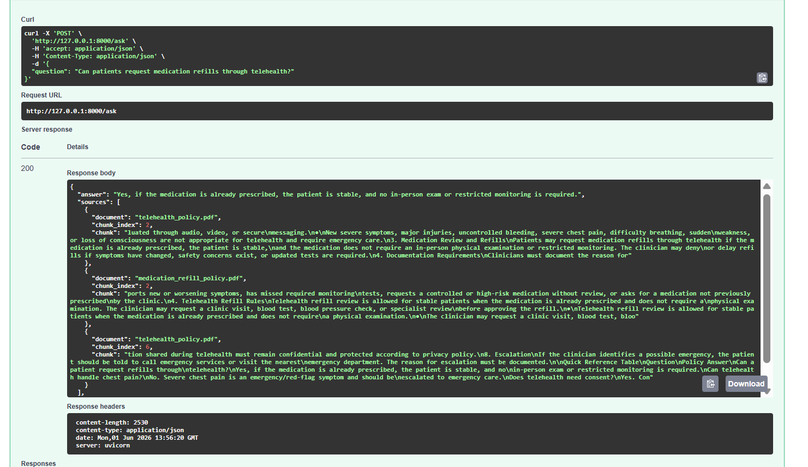
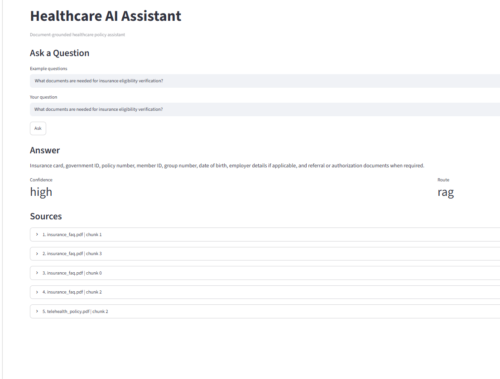
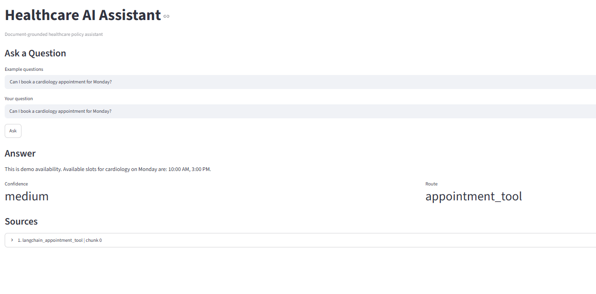
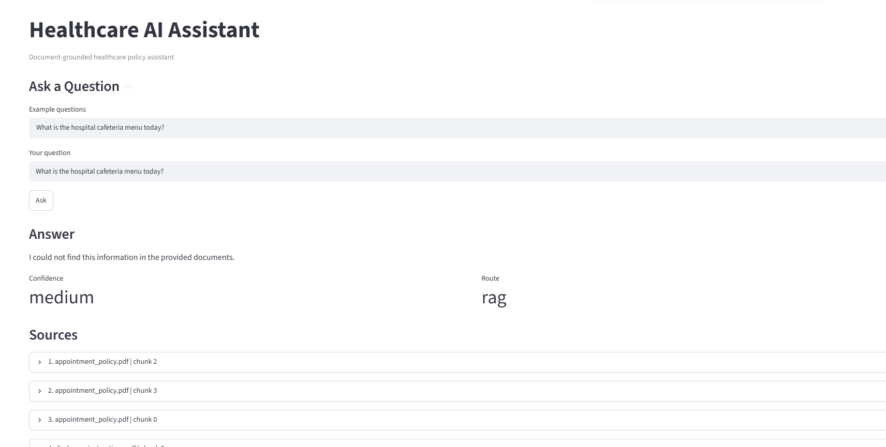

# Healthcare AI Assistant using RAG, Groq LLM, FastAPI, and Streamlit

A healthcare-focused AI assistant that answers questions from healthcare policy PDF documents using **Retrieval-Augmented Generation (RAG)**. The system retrieves relevant document chunks from a vector database and generates grounded answers using a Groq-hosted LLM.

This project includes **PDF ingestion, semantic search, ChromaDB vector storage, Groq LLM answer generation, source citations, confidence labels, FastAPI APIs, Streamlit chatbot UI, LangChain appointment tool routing, Docker support, and Railway deployment**.

---

## Live Backend

```text
https://healthcare-ai-assistant-rag-production.up.railway.app
```

API documentation:

```text
https://healthcare-ai-assistant-rag-production.up.railway.app/docs
```

---

## Objective

The goal of this project is to build a healthcare AI assistant that:

* Answers only from provided healthcare policy documents
* Avoids hallucination when information is not present
* Provides source references with document name and chunk index
* Routes appointment-related questions to a mock appointment tool
* Demonstrates a safe and explainable RAG workflow for healthcare use cases

---

## Problem Statement

Healthcare users often need quick answers from long policy documents such as telehealth guidelines, insurance FAQs, privacy policies, discharge instructions, and medication refill rules.

Manually searching these documents is time-consuming. A general chatbot may hallucinate or give unsafe answers. This project solves that by using a **document-grounded RAG pipeline** where the assistant only answers from trusted uploaded documents.

---

## Tech Stack

| Component          | Technology                             |
| ------------------ | -------------------------------------- |
| Backend            | FastAPI                                |
| Frontend / Demo UI | Streamlit                              |
| LLM                | Groq                                   |
| Embedding Model    | sentence-transformers/all-MiniLM-L6-v2 |
| Vector Database    | ChromaDB                               |
| PDF Processing     | pypdf                                  |
| Agent Workflow     | LangChain Tool                         |
| API Testing        | Swagger UI                             |
| Deployment         | Railway                                |
| Containerization   | Docker                                 |
| Language           | Python                                 |

---

## Key Features

* PDF document ingestion
* Text extraction from healthcare PDFs
* Document chunking
* Embedding generation using sentence-transformers
* ChromaDB vector storage
* Similarity-based context retrieval
* Groq LLM response generation
* Source citations with document name and chunk index
* Confidence label in API response
* Route label in API response
* Unknown-answer fallback handling
* Healthcare-safe prompting
* Appointment question routing using LangChain mock tool
* FastAPI backend APIs
* Streamlit chatbot-style demo UI
* Dockerfile and docker-compose support
* Railway deployment support

---

## Architecture Flowchart

```text
                    +------------------------------+
                    | User / Demo UI               |
                    | Streamlit or API Client      |
                    +--------------+---------------+
                                   |
                                   v
                    +------------------------------+
                    | FastAPI Backend              |
                    | /health  /ingest  /ask       |
                    +--------------+---------------+
                                   |
                                   v
                    +------------------------------+
                    | Question Router              |
                    | Appointment or RAG Query     |
                    +--------------+---------------+
                                   |
                     +-------------+-------------+
                     |                           |
                     v                           v
       +---------------------------+   +---------------------------+
       | Mock Appointment Tool     |   | RAG Pipeline              |
       | Department + Day Slots    |   | Retrieve + Generate       |
       +-------------+-------------+   +-------------+-------------+
                     |                               |
                     v                               v
       +---------------------------+   +---------------------------+
       | Appointment Response      |   | ChromaDB Similarity       |
       | route: appointment_tool   |   | + Context Retrieval       |
       +---------------------------+   +-------------+-------------+
                                                   |
                                                   v
                                     +---------------------------+
                                     | Retrieved PDF Chunks      |
                                     | Relevant Context          |
                                     +-------------+-------------+
                                                   |
                                                   v
                                     +---------------------------+
                                     | Groq LLM                  |
                                     | Safety-Grounded Prompt    |
                                     +-------------+-------------+
                                                   |
                                                   v
                                     +---------------------------+
                                     | Final API Response        |
                                     | answer + sources +        |
                                     | confidence + route        |
                                     +---------------------------+
```

---

## RAG Pipeline Flow

```text
              +----------------------+
              | Healthcare PDFs      |
              | data/ folder         |
              +----------+-----------+
                         |
                         v
              +----------------------+
              | PDF Text Extraction  |
              | using pypdf          |
              +----------+-----------+
                         |
                         v
              +----------------------+
              | Text Chunking        |
              | Smaller passages     |
              +----------+-----------+
                         |
                         v
              +----------------------+
              | Embedding Generation |
              | all-MiniLM-L6-v2     |
              +----------+-----------+
                         |
                         v
              +----------------------+
              | ChromaDB Vector DB   |
              | Store embeddings     |
              +----------+-----------+
                         |
                         v
              +----------------------+
              | Similarity Search    |
              | Retrieve top chunks  |
              +----------+-----------+
                         |
                         v
              +----------------------+
              | Groq LLM             |
              | Grounded generation  |
              +----------+-----------+
                         |
                         v
              +----------------------+
              | Final Answer         |
              | With sources         |
              +----------------------+
```

---

## API Flow

```text
POST /ingest
    |
    v
Read PDFs from data/
    |
    v
Extract text
    |
    v
Create chunks
    |
    v
Generate embeddings
    |
    v
Store in ChromaDB
    |
    v
Return total files and chunks
```

```text
POST /ask
    |
    v
Receive user question
    |
    v
Check question type
    |
    +--> Appointment question
    |       |
    |       v
    |   LangChain mock appointment tool
    |       |
    |       v
    |   Return appointment response
    |
    +--> Document question
            |
            v
        Retrieve relevant chunks from ChromaDB
            |
            v
        Send context + question to Groq LLM
            |
            v
        Return answer + sources + confidence + route
```

---

## Project Structure

```text
healthcare-ai-assistant/
├── app/
│   ├── __init__.py
│   ├── main.py              # FastAPI app and API routes
│   ├── config.py            # Configuration and environment variables
│   ├── embeddings.py        # Embedding model setup
│   ├── rag.py               # RAG ingestion and retrieval logic
│   ├── llm.py               # Groq LLM integration
│   └── agent.py             # LangChain appointment tool
│
├── data/
│   ├── appointment_policy.pdf
│   ├── discharge_instructions.pdf
│   ├── insurance_faq.pdf
│   ├── medication_refill_policy.pdf
│   ├── privacy_guidelines.pdf
│   └── telehealth_policy.pdf
│
├── screenshots/
│   ├── ingest_api.png
│   ├── ask_api_request.png
│   ├── ask_api_response.png
│   ├── streamlit_rag_answer.png
│   ├── streamlit_appointment_tool.png
│   └── streamlit_unknown_answer.png
│
├── streamlit_app.py         # Streamlit chatbot UI
├── requirements.txt
├── Dockerfile
├── docker-compose.yml
├── .dockerignore
├── .env.example
├── ARCHITECTURE.md
└── README.md
```

---

## Dataset Details

The project uses synthetic healthcare PDF documents placed inside the `data/` folder.

Document topics include:

* Telehealth policy
* Medication refill policy
* Appointment policy
* Privacy guidelines
* Insurance FAQ
* Discharge instructions

No real patient data, PHI, or confidential medical records are used.

---

## API Endpoints

| Method | Endpoint  | Purpose                                 |
| ------ | --------- | --------------------------------------- |
| GET    | `/`       | Root endpoint                           |
| GET    | `/health` | Check backend health                    |
| POST   | `/ingest` | Ingest PDFs and build vector store      |
| POST   | `/ask`    | Ask healthcare or appointment questions |

---

## Setup Instructions

### 1. Clone the Repository

```powershell
git clone https://github.com/aryanzende/healthcare-ai-assistant-rag.git
cd healthcare-ai-assistant-rag
```

### 2. Create Virtual Environment

```powershell
python -m venv venv
.\venv\Scripts\activate
```

### 3. Install Dependencies

```powershell
pip install -r requirements.txt
```

### 4. Create `.env` File

Create a `.env` file in the project root:

```env
GROQ_API_KEY=your_groq_api_key_here
GROQ_MODEL=llama-3.3-70b-versatile
```

Important: Do not commit `.env` to GitHub.

---

## Run FastAPI Backend Locally

```powershell
uvicorn app.main:app --reload
```

Open Swagger UI:

```text
http://127.0.0.1:8000/docs
```

Health check:

```text
http://127.0.0.1:8000/health
```

---

## Run Streamlit UI Locally

```powershell
streamlit run streamlit_app.py
```

Open:

```text
http://localhost:8501
```

---

## API Examples

### 1. Ingest Documents

Endpoint:

```http
POST /ingest
```

Sample response:

```json
{
  "message": "Documents ingested successfully",
  "total_files": 6,
  "total_chunks": 28
}
```

---

### 2. Ask RAG Question

Request:

```json
{
  "question": "What documents are required for insurance?"
}
```

Sample response:

```json
{
  "answer": "Insurance card, government ID, policy number, member ID, group number, date of birth, employer details if applicable, and referral or authorization documents when required.",
  "sources": [
    {
      "document": "insurance_faq.pdf",
      "chunk_index": 1,
      "chunk": "Patients may need to provide insurance card, government ID, policy number, member ID, group number..."
    }
  ],
  "confidence": "medium",
  "route": "rag"
}
```

---

### 3. Ask Telehealth Question

Request:

```json
{
  "question": "Can patients request medication refills through telehealth?"
}
```

Sample response:

```json
{
  "answer": "Yes, patients may request medication refills through telehealth if the medication is already prescribed, the patient is stable, and the medication does not require an in-person physical examination or restricted monitoring.",
  "sources": [
    {
      "document": "telehealth_policy.pdf",
      "chunk_index": 2,
      "chunk": "Medication refill requests may be reviewed during telehealth visits..."
    }
  ],
  "confidence": "medium",
  "route": "rag"
}
```

---

### 4. Ask Appointment Question

Request:

```json
{
  "question": "Can I book a cardiology appointment for Monday?"
}
```

Sample response:

```json
{
  "answer": "This is demo availability. Available slots for cardiology on Monday are: 10:00 AM, 3:00 PM.",
  "confidence": "medium",
  "route": "appointment_tool"
}
```

---

### 5. Unknown Answer Handling

Request:

```json
{
  "question": "What is the CEO's salary?"
}
```

Expected response:

```text
I could not find this information in the provided documents.
```

This shows that the assistant avoids guessing when the answer is not available in the provided documents.

---

## Sample Questions for Testing

```text
What documents are required for insurance?
What are the privacy rules for patient data?
Can patients request medication refills through telehealth?
When can a medication refill be denied?
What should patients do after hospital discharge?
Can I book a cardiology appointment for Monday?
Is there any dermatology slot available on Friday?
Can patient data be used in AI testing or demos?
Can you diagnose my chest pain?
What is the CEO's salary?
```

---

## Prompting Strategy

The Groq LLM is instructed to follow a healthcare-safe grounded prompt.

The assistant must:

* Answer only from retrieved context
* Not use outside knowledge
* Not guess missing information
* Avoid diagnosis, prescription, or unsafe medical advice
* Return a fallback response when information is unavailable

Fallback response:

```text
I could not find this information in the provided documents.
```

---

## Routing Strategy

The system uses a simple question router.

```text
Appointment-related query
        ↓
LangChain mock appointment tool
        ↓
route: appointment_tool
```

```text
Healthcare document query
        ↓
RAG retrieval pipeline
        ↓
route: rag
```

This allows the assistant to handle both document-based questions and mock appointment availability queries.

---

## Screenshots

### Document Ingestion API

Shows the `/ingest` endpoint reading healthcare PDFs from the `data/` folder, creating chunks, generating embeddings, and storing them in ChromaDB.



---

### Ask API Request

Shows the `/ask` endpoint accepting a user question in JSON format.



---

### Ask API Response with Sources

Shows the RAG answer generated using retrieved PDF chunks. The response includes answer, sources, confidence, and route.



---

### Streamlit RAG Answer

Shows the Streamlit UI answering a healthcare document question using the RAG pipeline.



---

### LangChain Appointment Tool

Shows appointment-related questions being routed to the LangChain mock appointment tool instead of RAG.



---

### Unknown Answer Handling

Shows how the assistant avoids hallucination. When the answer is not found in the documents, it returns the fallback response instead of guessing.



---

## Docker Usage

### Build Docker Image

```powershell
docker build -t healthcare-ai-assistant .
```

### Run Docker Container

```powershell
docker run -p 8000:8000 --env-file .env healthcare-ai-assistant
```

Open:

```text
http://localhost:8000/docs
```

---

## Deployment

### Backend Deployment

The FastAPI backend is deployed on Railway.

Live backend:

```text
https://healthcare-ai-assistant-rag-production.up.railway.app
```

Swagger UI:

```text
https://healthcare-ai-assistant-rag-production.up.railway.app/docs
```

### Required Railway Environment Variables

```env
GROQ_API_KEY=your_groq_api_key_here
GROQ_MODEL=llama-3.3-70b-versatile
```

---

## Environment Variables

| Variable       | Purpose                               |
| -------------- | ------------------------------------- |
| `GROQ_API_KEY` | API key for Groq LLM                  |
| `GROQ_MODEL`   | Groq model name                       |
| `API_BASE_URL` | Optional backend URL for Streamlit UI |

---

## Key Design Decisions

| Decision                | Reason                                               |
| ----------------------- | ---------------------------------------------------- |
| FastAPI backend         | Lightweight, fast, production-friendly API framework |
| Streamlit UI            | Quick and clean demo interface                       |
| ChromaDB                | Simple local vector database for RAG                 |
| sentence-transformers   | Open-source embedding model                          |
| Groq LLM                | Fast response generation                             |
| Source citations        | Improves transparency and trust                      |
| Unknown answer fallback | Reduces hallucination                                |
| Mock appointment tool   | Demonstrates agent/tool routing                      |
| Docker                  | Makes deployment consistent                          |

---

## Limitations

* Answers only from provided PDFs
* Mock appointment system only
* No real hospital or EHR integration
* No authentication system
* No scanned PDF OCR
* No page-level citation yet
* Not suitable for diagnosis, emergency, or treatment decisions

---

## Future Improvements

* Add PDF upload from Streamlit UI
* Add OCR support for scanned PDFs
* Add page-level citations
* Add authentication
* Add PHI masking
* Add conversation memory
* Add real appointment API integration
* Add admin dashboard for document management
* Add monitoring and logging
* Deploy Streamlit UI publicly

---

## Healthcare Safety Note

This project is for demo and educational purposes only.

It does not use real patient data or PHI. It should not be used for diagnosis, treatment, emergency decisions, or real clinical workflows.

For medical emergencies, users should contact emergency services or a qualified healthcare professional.

---

## Author

**Aryan Zende**

Built with FastAPI, Streamlit, Groq, ChromaDB, LangChain, and RAG.
